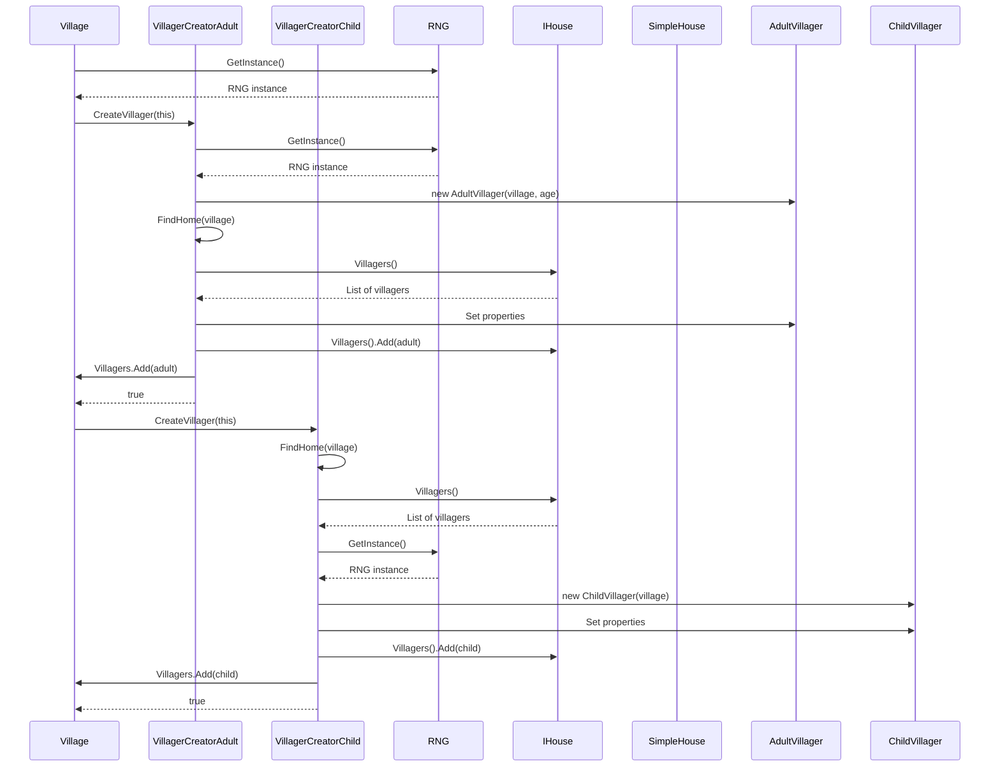

UML Class Diagram

```mermaid

classDiagram
    class Village {
        +RNG _random
        +List~BaseVillager~ Villagers
        +List~ILocation~ Locations
        +VillagerNames VillagerNameLibrary
        +Village()
        +void CreateVillage()
        +List~IVillagerCreator~ LoadVillagerCreatorFactories()
        +void LoadVillagerCreatorFactoriesFromType(IEnumerable~Type~ inputTypes, List~IVillagerCreator~ outputVillagerCreators)
        +string ToString()
    }

    class IVillagerCreator {
        <<interface>>
        +bool CreateVillager(Village village)
    }

    class VillagerCreatorAdult {
        +bool CreateVillager(Village village)
        +IHouse FindHome(Village village)
    }

    class VillagerCreatorChild {
        +bool CreateVillager(Village village)
        +IHouse? FindHome(Village village)
    }

    class IHouse {
        <<interface>>
        +int Population
        +int MaxPopulation
        +List~BaseVillager~ Villagers()
    }

    class BaseVillager {
        +string FirstName
        +string LastName
        +bool IsMale
        +IHouse Home
    }

    class AdultVillager {
        +AdultVillager(Village village, int age)
    }

    class ChildVillager {
        +ChildVillager(Village village)
    }

    class RNG {
        +static RNG GetInstance()
        +int Next(int minValue, int maxValue)
    }

    class VillagerNames {
        +static VillagerNames GetInstance()
        +string GetRandomFirstName(bool isMale)
    }

    class SimpleHouse {
        +int Population
        +int MaxPopulation
        +List~BaseVillager~ Villagers()
    }

    Village --> IVillagerCreator
    IVillagerCreator <|-- VillagerCreatorAdult
    IVillagerCreator <|-- VillagerCreatorChild
    VillagerCreatorAdult --> IHouse
    VillagerCreatorChild --> IHouse
    IHouse <|.. SimpleHouse
    BaseVillager <|-- AdultVillager
    BaseVillager <|-- ChildVillager
    Village --> RNG
    Village --> VillagerNames
    RNG --> "1" RNG
    VillagerNames --> "1" VillagerNames


```

UML Sequence Diagram

```mermaid

sequenceDiagram
    participant Village
    participant VillagerCreatorAdult
    participant VillagerCreatorChild
    participant RNG
    participant IHouse
    participant SimpleHouse
    participant AdultVillager
    participant ChildVillager

    Village->>RNG: GetInstance()
    RNG-->>Village: RNG instance
    Village->>VillagerCreatorAdult: CreateVillager(this)
    VillagerCreatorAdult->>RNG: GetInstance()
    RNG-->>VillagerCreatorAdult: RNG instance
    VillagerCreatorAdult->>AdultVillager: new AdultVillager(village, age)
    VillagerCreatorAdult->>VillagerCreatorAdult: FindHome(village)
    VillagerCreatorAdult->>IHouse: Villagers()
    IHouse-->>VillagerCreatorAdult: List of villagers
    VillagerCreatorAdult->>AdultVillager: Set properties
    VillagerCreatorAdult->>IHouse: Villagers().Add(adult)
    VillagerCreatorAdult->>Village: Villagers.Add(adult)
    VillagerCreatorAdult-->>Village: true

    Village->>VillagerCreatorChild: CreateVillager(this)
    VillagerCreatorChild->>VillagerCreatorChild: FindHome(village)
    VillagerCreatorChild->>IHouse: Villagers()
    IHouse-->>VillagerCreatorChild: List of villagers
    VillagerCreatorChild->>RNG: GetInstance()
    RNG-->>VillagerCreatorChild: RNG instance
    VillagerCreatorChild->>ChildVillager: new ChildVillager(village)
    VillagerCreatorChild->>ChildVillager: Set properties
    VillagerCreatorChild->>IHouse: Villagers().Add(child)
    VillagerCreatorChild->>Village: Villagers.Add(child)
    VillagerCreatorChild-->>Village: true


```
