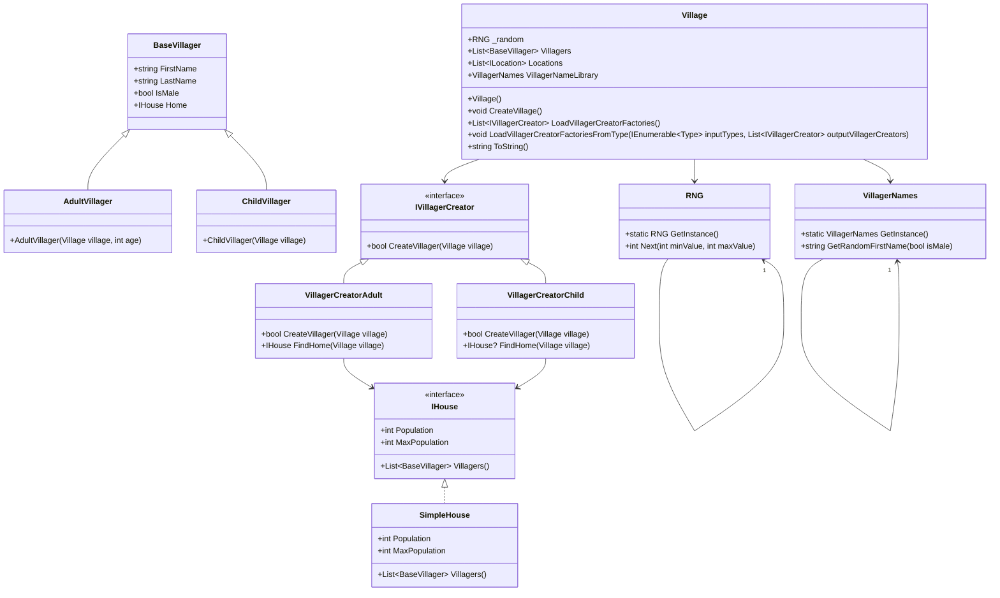

```mermaid

classDiagram
    class Village {
        +RNG _random
        +List~BaseVillager~ Villagers
        +List~ILocation~ Locations
        +VillagerNames VillagerNameLibrary
        +Village()
        +void CreateVillage()
        +List~IVillagerCreator~ LoadVillagerCreatorFactories()
        +void LoadVillagerCreatorFactoriesFromType(IEnumerable~Type~ inputTypes, List~IVillagerCreator~ outputVillagerCreators)
        +string ToString()
    }

    class IVillagerCreator {
        <<interface>>
        +bool CreateVillager(Village village)
    }

    class VillagerCreatorAdult {
        +bool CreateVillager(Village village)
        +IHouse FindHome(Village village)
    }

    class VillagerCreatorChild {
        +bool CreateVillager(Village village)
        +IHouse? FindHome(Village village)
    }

    class IHouse {
        <<interface>>
        +int Population
        +int MaxPopulation
        +List~BaseVillager~ Villagers()
    }

    class BaseVillager {
        +string FirstName
        +string LastName
        +bool IsMale
        +IHouse Home
    }

    class AdultVillager {
        +AdultVillager(Village village, int age)
    }

    class ChildVillager {
        +ChildVillager(Village village)
    }

    class RNG {
        +static RNG GetInstance()
        +int Next(int minValue, int maxValue)
    }

    class VillagerNames {
        +static VillagerNames GetInstance()
        +string GetRandomFirstName(bool isMale)
    }

    class SimpleHouse {
        +int Population
        +int MaxPopulation
        +List~BaseVillager~ Villagers()
    }

    Village --> IVillagerCreator
    IVillagerCreator <|-- VillagerCreatorAdult
    IVillagerCreator <|-- VillagerCreatorChild
    VillagerCreatorAdult --> IHouse
    VillagerCreatorChild --> IHouse
    IHouse <|.. SimpleHouse
    BaseVillager <|-- AdultVillager
    BaseVillager <|-- ChildVillager
    Village --> RNG
    Village --> VillagerNames
    RNG --> "1" RNG
    VillagerNames --> "1" VillagerNames


```
